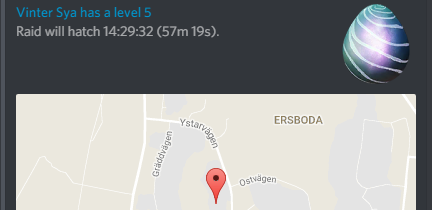
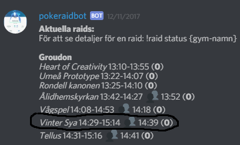

# How to setup bot integration for Pokeraidbot

## Why?

Pokeraidbot can integrate with either [Gymhuntr](https://gymhuntr.com) bot or [PokeAlarm](https://github.com/PokeAlarm/PokeAlarm).

Doing this means that your users will have a *much* easier time with the raid handling, and not have to learn a 
whole lot of commands.

What happens is that you configure either of the bots above to scan for raids, and publish them into 
a discord channel. Pokeraidbot can, if it has access to said channel, pick up those published raids,
and set them up for its own use, meaning users will never have to write !raid start/new/end commands.

The bot integration can also automatically create raid groups for tier 5 raids, 10 minutes after hatch time.

### How it works in pictures 

PokeAlarm announcing a tier 5 raid about to hatch:

Pokeraidbot detects what tier raid (from "level 5"), what gym ("Vinter Sya") and what time ("14:29") 
from the message, and creates a raid internally. 

Yes, **this means that the messages of your PokeAlarm need to 
look like above, or the bot will not be able to interpret them correctly**.

The raid will then show up as normal in the overview:

Note that Pokeraidbot can also automatically create a raid group for this raid, 
to start at 10 minutes after hatching time.

If set up this way, the users don't have to do anything other than keep track of raids via the
overview, and sign up for the group via clicking emotes.

If users want the group to run at another time, either an admin can change the time of the group, or
a user can create their own group via *!raid group (time) (gym)*

So how do you get this working?

## Setting up Gymhuntr

Go to the PokeHuntr discord via their [invite link](https://discordapp.com/invite/WrPF9Sg) to ensure up-to-date instructions.

Essentially, what you need to do is:

* Authorize the bot via this link: [https://goo.gl/7ZZ1yc]
* Go to https://gymhuntr.com/ and load your current location. Click on a gym in the centre of where you want the Bot to watch. 
* Right click or tap on Get Directions and copy the link. At the end of the link you will find the GPS coords you will need to setup the Bot.
* Once you've added GymHuntrBot to the channel, issue the setup command and the GPS coords. Example: !setup 34.111,124.222

Congratulations, you've now set up the bot!

Add level filters by using Raid Tiers. The Raid Tiers you filter and up are the ones you want to see.

    !level 4
  
Add Pokémon filters by using Pokémon IDs. The Pokémon you filter are the ones you want to see.
  
    !filter 131,143,248
  
To mute GymHuntrBot, you can use the stop and and start commands without losing the set location and filters.
  
To change locations, you can re-issue the setup command without losing the set level and filters.
  
To clear any of the filters or level commands, set to 0.
  
### Full Command List ###
  
      !setup - Used with GPS coords. GymHuntrBot watches this location.
      !level - Used to filter which level raids GymHuntrBot will alert you to.
      !filter - Used to filter which Pokémon GymHuntrBot will alert you to.
      !radius- Used to change the radius of how far GymHuntrBot will alert you.
      !start - Starts GymHuntrBot. It will start sending scan data.
      !stop - Stops GymHuntrBot. It will stop sending scan data.
      !info - Shows the location, filters and status of GymHuntrBot.

### Worth noting ###

Gymhuntr is only as effective as the scans of the area. To ensure you catch raids early, you need to ensure
the area is constantly scanned, for example via their home page, or purchasing VIP scans.
      
## Setting up PokeAlarm

This is where you can find up to date instructions on how to setup PokeAlarm: [https://github.com/PokeAlarm/PokeAlarm]

### Worth noting ###

PokeAlarm seems to generally pick raids up faster than Gymhuntr due to setting up custom scan bots. 
It's better, but also a lot more work to ensure your scanners aren't banned. Up to you to decide.

## Configuring Pokeraidbot for bot integration ##

Run the command *!raid install* in your server chat. Be the server's administrator.

The install command answers in DM and gives you an example command for how to setup your server so
Pokeraidbot knows what map region to use, what language etc.

In order to activate bot integration, your command needs to look something like this:

!raid install server={your server name};region={map region};replyInDm=false;locale={sv for swedish, en for english};mods={your moderators role name};feedback=REMOVE_ALL_EXCEPT_MAP;groupCreation=NAMED_CHANNEL;groupChannel=raidgroups;botIntegration=true;pinGroups=false

The key properties are these:

groupCreation=NAMED_CHANNEL;groupChannel=raidgroups;botIntegration=true

groupCreation means that automatically created raid groups will be put in a named channel (specified by the groupChannel property).

If you want to place groups in the same channel as the raids being announced (which I would **NOT** recommend), 
replace NAMED_CHANNEL with SAME_CHANNEL and skip the groupChannel property. 

botIntegration is the property that tells the bot if it should listen for raidbot messages or not. Set it to *true* 
to enable integration, *false* to turn it off.

That's it.

## Why would I use bot integration? It's CHEATING! ##

Funnily, my home server agrees with you. There, we only use manual raid reporting, group creation etc.

Upside is, we don't rely on scanners and are not cheating. Downside is, it's more work for your users to learn commands
and use them properly, and will require more of your moderators helping your users out.

Personally, I don't judge you for whatever you decide to do on your server, I just provide tools to give you options.

GOOD LUCK!