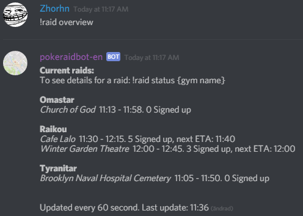
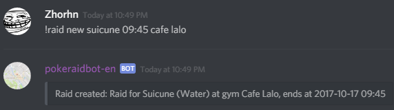
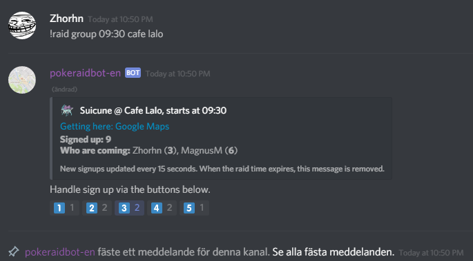
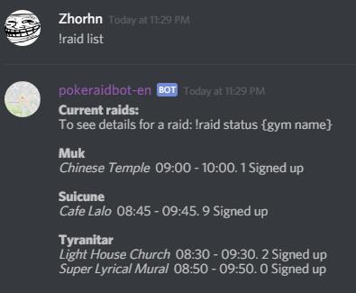
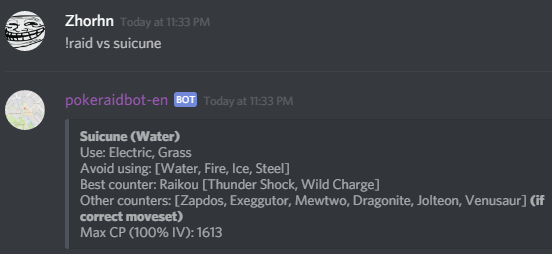
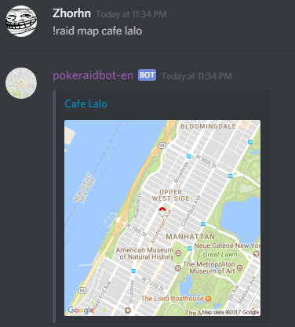

Are you interested in Pokemon Go raiding? Are you a new member of a Discord-server that uses pokeraidbot? 
Maybe you'd like to know how to get a hang of it, without spending a lot of time reading documentation and manuals?

This getting started guide might be of assistance.

For starters, your server should have a channel with a *raid overview*.

It's a read-only channel that only contains a single command and a message with
all current raids and signups, to give you a quick overview of what raids are available, and which ones
would most likely happen since there are enough signups.

Here is an example:

The symbol of a black and gray head means that after it, available groups for the raid
will be listed (if there are any), as well as how many are signed up.

So, how can you contribute to what the bot shows in the overview?

You can:
* Report raids you see in-game, or let a bot like Gymhuntr or PokeAlarm report raids automatically (pokeraidbot can integrate with them)
* Sign up for raids via the bot, either using groups or directly via +2-syntax (see below)
* Help each other out :)

Here are some instructions on how to do this in practice.

So you have discovered a raid nearby that you want to share with your friends?
The raid is for a Suicune at the gym Café Lalo, and it **expires** at 09:45.

Type the following in your server's text channel where pokeraidbot is active:

*!raid new Suicune 09:45 cafe lalo*

(or *!r n suicune 945 cafe lalo* if you want to keep it short)

If you think it's too much of a pain to figure out the end time of a raid, you can report the raid via start 
time/hatch time - use *!raid start Suicune 09:00 cafe lalo* instead.

(or *!r s suicune 900 cafe lalo* if you want to keep it short)

Then, you want to create a group that raids at 09:30.

Type the following:
*!raid group 09:30 cafe lalo*

(or *!r g 930 cafe lalo* if you want to keep it short)

To sign up yourself to the raid, click the emote with number "1". If you have two friends who are joining,
click the emote with the number "3" to sign up yourself and your friends.

If you click the emote you chose again, the signup for the person(s) you added to the group are removed.

So why is there a 2 next to the emote that you pressed?

Well, in order for you to have emotes to press, the bot needs to react to the message first.
It adds all the emotes you can see on the picture above, and listens for if a user presses them.

The group's signups will automatically be updated every 15 seconds, and when it's time for your group to 
start the raid, the group message will be automatically removed (5 minutes after raid start, so you have time to
do a ready-check with the people you know should be there).

If you want to create a raid AND a group directly at hatch time, use the combined command:

*!raid start-group suicune 9:00 cafe lalo*

(or *!r sg suicune 900 cafe lalo*)

Do you want to see the current active raids, which have been reported? 

The best way is of course to use the overview mentioned above, but you can also type the following:

*!raid list*

If you want to see what raids are only for a certain pokemon, for example Suicune, type the following:

*!raid list Suicune*

.. and you'll see only those raids.

Do you want help with deciding what pokemons to use against your raid boss?

Type the following:

*!raid vs suicune*

Do you need help finding the gym the raid is at? Type:

*!raid map cafe lalo*

You'll get a static mini map of the gym, but you can also click the Gym name for a link to Google Maps,
featuring directions, calculating how long it will take you to get there, and being able to save the location. 

For more detailed help, access the help manual via typing:

*!raid man*

It will respond in direct message and give you assistance with choosing the right help manual topics.
To read help for a certain topic, type for example:

*!raid man raid*

.. to get help on raid functions, such as reporting a raid. The available help manual topics are:

* raid - Raid functions, like reporting a raid, seeing a list of available raids, and checking details for a certain raid
* change - Functions to change a raid, such as changing the raid boss, the expiry time etc. (if the reporter made a mistake for example)
* signup - Functions to sign up to a raid, and removing your signup
* group - How to create a raid group for a certain time, like the example above
* tracking - Tell the bot to notify the user in direct message if a raid is reported for a raid boss you're interested in
* install - How a server administrator gets the bot working

If you type the following, you get help in direct messages:

*!raid man raid dm*

If you type like this, you can get help either in DM or in server chat, depending on what settings you have for your server:

*!raid man raid*

I hope this gives you an idea of what the bot can do, and that it shouldn't be **too** hard to get started.

Report any problems or suggestions via Github's issue handling.

Good luck and have fun!

## FAQ ##

* Can I report an egg without the raidboss having hatched?

**Yes.** You can replace the raidboss' name with Egg1-6, depending on the tier of the raid (level 1-6).

If the boss is an unhatched tier 5 boss, the pokemon name should be "Egg5". 

Here's an example of how to create a raid for an unhatched tier5-egg due to hatch at 9:00 at the gym Blenda:

    !raid start Egg5 9:00 Blenda
    
When the egg hatches, you can report what boss spawned via the command (example for the boss Groudon):

    !raid hatch Groudon Blenda
    
Users using !raid track to keep track of raids for a certain pokemon, will then receive a DM from the raidbot as usual.

* Can I create a raid group for an unhatched egg?

**Yes, if a raid has been created via a command like above.** Use the same command as usual: !raid group (time) (gym)