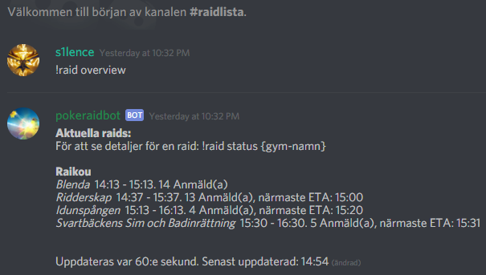
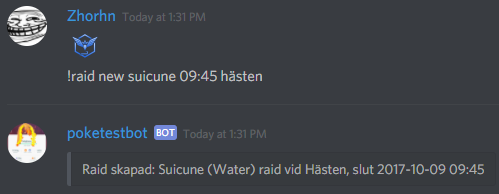
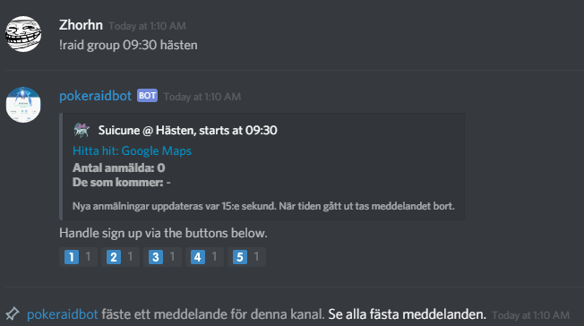
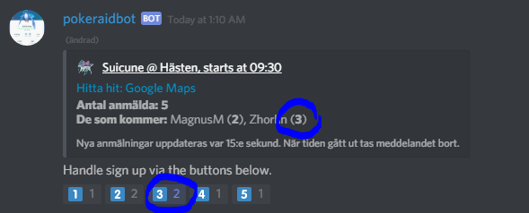
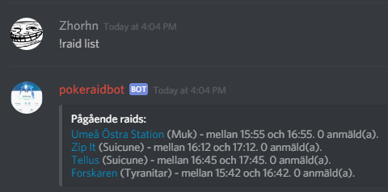
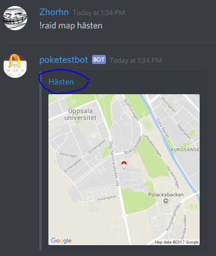

Är du raidsugen, och ny medlem i en Discord-server som använder pokeraidbot? 
Vad kan vara värt att lära sig för att få ut det mesta utan att lära sig allt?

Till att börja med, din server borde ha en kanal med en *raidöversikt*. I Uppsala heter den #raidlista.

Det är en kanal som är skrivskyddad och innehåller bara ett kommando och ett meddelande
med en lista över alla pågående raider och vilka anmälningar som är gjorda,
för att snabbt visa dig vilka raider som troligen kommer bli av och kan vara värda att satsa på. :)

Exempel här:

Symbolen med en svart och grå gubbe betecknar att efter detta kommer tider för 
grupper för raiden listas, om det finns några, samt hur många som är anmälda till just den gruppen.

Hur gör man då för att bidra till det botten visar upp här?

Jo, man kan:
* Rapportera raider man ser i spelet (eller låta en bot anmäla raider automatiskt via integration med t.ex. Gymhuntr eller PokeAlarm)
* Anmäla sig till raider, antingen via grupper eller direkt
* Hjälpas åt :)

Nedan kommer lite instruktioner för hur man kan göra det.

Så du har upptäckt en raid i din närhet som du vill dela med dig av? Raiden är för en Suicune, som **slutar** kl 09:45 vid gymmet Hästen.

Skriv då följande i kanalen som är till för att skapa den typen av raid (#suicune_raid i Uppsala):

*!raid new Suicune 09:45 hästen*

(eller *!r n suicune 945 hästen* för att hålla det kort)

Vill du rapportera utifrån starttid för en raid för det är jobbigt att räkna ut sluttid?
Använd *!raid start Suicune 09:00 hästen* istället.

(eller *!r s suicune 900 hästen* för att hålla det kort)

Du vill sedan skapa en grupp som kör raiden 09:30.

Skriv då följande i kanalen för Suicune-raider (#suicune_raid i Uppsala):

*!raid group 09:30 hästen*

(eller *!r g 930 hästen*)

Klicka sedan på emoten för siffran "1" för att anmäla bara dig. Om du har 2 vänner med dig, klicka på knappen "3" så anmäler du dig själv + dem.
Om du klickar på ikonen igen, tas anmälan för de personer du lade till bort från gruppen.

Varför står det en 2:a bredvid ikonen för 1:an du tryckte på för att anmäla en person? 

Tja, för att du ska ha knappar att trycka på, så måste botten "reagera" på inlägget först. 
Den lägger till alla emotes du ser på bilden ovan och lyssnar sedan efter om någon trycker på dem. 

Gruppens anmälningar kommer automatiskt uppdateras var 15:e sekund, och när din grupp ska köra, kommer meddelandet i Discord automatiskt tas bort.

Om man vill skapa en raid med en grupp direkt vid kläckning, kan man göra detta via det kombinerade kommandot:

*!raid start-group suicune 9:00 hästen*

(eller *!r sg suicune 900 hästen*)

Vill du se vilka raids som är på gång just nu?

Bäst är ju att kolla på översikten som vi nämnde tidigare, men du kan också skriva följande i kanalen för 
botspam för att se alla möjliga raider:

*!raid list*

Vill du sedan se vilka raider som bara är för en viss pokemon, t.ex. Suicune, skriv följande:

*!raid list Suicune*

.. så får du bara se aktuella raider för just den bossen.

Vill du få hjälp med vilka pokemons som är bra mot din raidboss?

Skriv då följande i kanalen för botspam (#bot):

*!raid vs suicune*

Vill någon ha hjälp att hitta till gymmet Hästen? Det finns dels länkar från olika meddelanden, 
men sedan kan man också skriva:

*!raid map Hästen*

Där får man en minikarta som kan hjälpa till med orientering. 

Vill man sedan ha en bra vägbeskrivning från där man är nu, kan man klicka på gymnamnet, 
och då laddas Google Maps.

För mer detaljerad hjälp kring botten, skriv följande:

*!raid man*

Den svarar i direktmeddelande vilka hjälpämnen som finns. Sedan kan man t.ex. skriva

*!raid man raid*

.. för att få hjälp kring funktioner rörande raids, som att skapa dem. Dessa hjälpämnen finns:

* raid - Raidfunktioner, som att skapa en raid, se en lista över raids du kan köra och kika på detaljer för en raid vid ett visst gym
* change - Funktioner för att ändra en skapad raid, som att ändra pokemon eller byta sluttid (om man gjorde fel)
* signup - Funktioner för att anmäla sig till en raid, eller ta bort anmälan
* group - Hur man skapar en raidgrupp enligt bilden ovan och hur det funkar
* tracking - Hur man kan använda botten för att få meddelande om en raid skapas för en viss pokemon man är intresserad av
* install - Hur en serveradministratör får botten att fungera

Skriver man följande får man hjälp i direktmeddelande:

*!raid man raid dm*

Skriver man såhär får man hjälp antingen i DM eller i serverchatten, beroende på vilka inställningar ni har för er server:

*!raid man raid*

Hoppas detta ger en idé om vad botten kan göra, och att det inte ska behöva vara så himla svårt. 
Rapportera gärna problem eller kom med förslag via Github's ärendehantering.

Lycka till!

## Vanliga frågor ##

* Kan jag rapportera ägg innan en raidboss kläckts?

**Ja.** Man kan ersätta raidbossens namn med Egg1-6, beroende på bossnivå. Om det är ett tier 5-ägg, blir
pokemonnamn "Egg5". Exempel på hur man skapar en raid för ett tier5-ägg som kläcks kl 9.00 vid gymmet Blenda:

    !raid start Egg5 9:00 Blenda
    
Man anmäler sedan vad det blev för boss i praktiken via ett kommando som

    !raid hatch Groudon Blenda
    
Användare som kör med !raid track för att hålla koll på raider för en viss pokemon, kommer då få DM som vanligt.

* Kan jag skapa en raidgrupp för ett okläckt ägg?

**Ja, om någon skapat en raid enligt ett kommando som ovan.** Använd det vanliga kommandot: !raid group (tid) (gym)