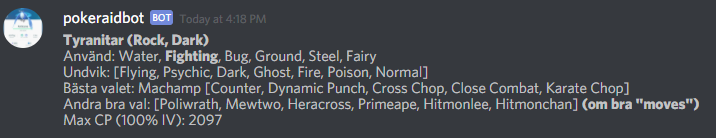
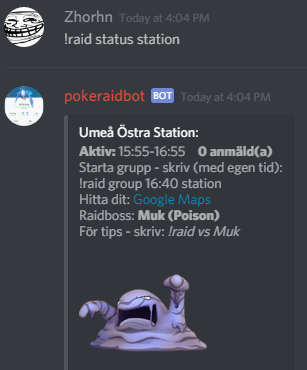
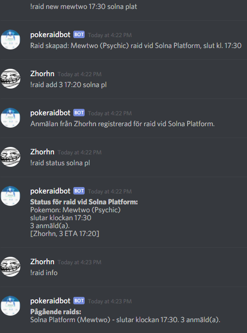

# pokeraidbot
A Discord Pokemon go raiding bot, used to announce raids, sign up for them and get an overview.
Also contains commands for getting information about pokemons, pokestops and gyms.

## What is this?

Best to show some screenshots I guess. These are in Swedish, but there is also English locale.

Command to get map of a gym:

Command to get raid boss info:

Raid commands:

## Support development

Please do. :) It will help out a lot if it happens that I need to move from
the free Heroku version to a "pay per month" version with more room for data,
better availability etc.

Click below:

## Setting up the bot in your Discord server

### How do I get the gym data for MY region in there?
Since you probably want the gyms for YOUR region in YOUR bot, here are instructions on how to import them. 
If you know what you're doing (i.e. you're a developer), scroll down to instructions on how to use the 
data import tool. 

Non-developers need to contact Magnus (the developer of the bot) at magnus.mickelsson@gmail.com - send an email explaining
* Who you are and where you want to add the bot
* What region you want data for (Country, City, area in city)

Magnus will then use the data import tool go create a data file for your region and deploy it with the bot.
Allowing admins to run the data import on the fly and putting it in the database
is on the todo-list, but will require a non-free Heroku version, most likely. :(

Optional steps:
* If you know something about computers and want to make Magnus' life easier, try creating the data file
for your region yourself, see instructions further down
* A Discord invite link to your server so Magnus can login and help out with setting it up, if needed

Right now, the bot has datasets for a few major cities in Sweden, such as Stockholm, Uppsala, Luleå, Umeå, 
Norrköping etc.

### Inviting the bot to your server
Go to [https://pokeraidbot2.herokuapp.com]() - use the link there and you'll use Discord's built in handling
of inviting a bot to your server.

### Setting up permissions
Assign the bot the following permissions:

* Manage channels (to create channel on the fly for new raids, if so desired)
* Create invitation (not used yet)
* Manage emojis
* Manage webhooks
* Read text channels
* Send messages
* Manage messages (needs to edit raid group message)
* Embed links (map function)
* Attach files (not used yet)
* Read message history
* Mention all (not used yet)
* Use external emoji
* Add reactions
   
### Configuring your server against the bot
This step requires your admin to have invited the bot into your server, and set up the role and 
permissions of the bot (as described above).
 
* Verify bot has logged in and is present in your server, with correct role/permissions
* Run the command: *!raid install*
* Follow the instructions you'll get in DM. Read them and you should be able to sort it out. If you don't,
the bot should be able to tell you what's wrong.

## Setting up your own server/For Developers
How do I setup my own server and/or help with development?

### Prerequisities

* You need to have Java 8 installed
* You need to have Maven 3+ installed
* You need to be administrator on your local machine
* It's probably a good idea if you know a bit about Java development, and Spring Boot
* You need to be administrator of a Discord server with permission to add a bot
* USE **UTF-8** ENCODING. In your server configuration, in your IDE, errwhere.

### Step by step
* To get started, you need to create a Discord application via their 
[developer site](https://discordapp.com/developers/docs/intro), and register a Bot account for it. 
When doing this, you get an owner id (client id) and a token for your bot account.
* Clone this Git repository to your local machine: https://github.com/magnusmickelsson/pokeraidbot.git
* Build your application via [Maven](https://maven.apache.org) or a Java-IDE, for example 
[IntelliJ](https://www.jetbrains.com/idea/).
* Check the file src/main/resources/application.properties. Decide what type of database you're going to run (file is currently
prepared for Heroku deploy but has stuff commented out for running local in-memory DB via H2
or a local Postgres)
* Start the bot via the executable class **main.BotServerMain** (or java -jar pokeraidbot.jar)

NOTE: You need to provide two application properties so it can start, ownerId and token. Example:

    java -jar pokeraidbot.jar --ownerId={your owner_id from registering a bot app/account above} --token={bot secret token as above}
    
In IntelliJ, add

    --ownerId={your owner_id from registering a bot app/account above} --token={bot secret token as above}
    
to the "Program Arguments" field when creating a run configuration.

If you don't Spring will complain that the properties are not available, and the application won't start.

* Try browse http://127.0.0.1:5000/ - if it works you'll get a response from the bot
* Use the Discord link from the response above to invite the bot into a Discord server of your choice
* Check the instructions way above on how to configure the bot for your server. Follow the instructions. Don't be *that* guy/girl.
* In the chat, try running the command "!raid usage". Take it from there.

### Gym data import
First check the file gyms_uppsala.csv to see an example of the data such a file should have. 
It's a good idea to keep the uppsala file around though so you don't have to change the JUnit test suite.

The recommended way to create a dataset for your region is to use the **GymDataImportTool** class. Run this mainclass:

        dataimport.GymDataImportTool

.. with these parameters: {number of kilometres which will be a side of a "box" we get gyms from} {search entry for region centre (will be centre of the "box")}

Example:

        dataimport.GymDataImportTool 20 falun
        
.. will create a dataset file called falun.csv under {project_dir}/target/ folder, which contains
all gyms/raids within 10 km of the centre of the city Falun in Sweden (centre as defined by Google maps).

Copy this file into src/main/resources/ - name it gyms_falun.csv and it will be available to be used by a Discord server,
which is then to be configured to have the region falun.

**NOTE: Bot needs to be restarted when new region files are added** (right now, will change in the future).

### Hosting
I'd recommend you deploy your adapted bot to a cloud service, or use a local server you know works and will be up.

Personally, I used Heroku's free service, available here:

http://herokuapp.com

To get started, create an account there and then follow these instructions (after you've got it working locally, obviously):

https://devcenter.heroku.com/articles/getting-started-with-java#introduction

Things to note about Heroku:
* Choose the correct region when you create your Heroku application; eu or us! Example for eu:

        heroku create {app_name} --region=eu

* Choose the correct timezone for your application, for example: 
    
        heroku config:add TZ="Europe/Stockholm"
        
The bot is currently deployed on a Heroku node in EU backed by a Postgresql database, at Stockholm timezone,
here: https://pokeraidbot2.herokuapp.com

## Who?

Bot created by Magnus Mickelsson - done mostly during evenings after the kids went to bed, so cut me some slack :( 

Valuable contributions also by Johan Millert.

Thanks for the support from the people of the Pokemon Go Uppsala Discord server, primarily s1lence and Xandria.

## Notes

It's very likely you need to know a bit of Java and Spring Boot for this application to be useful to you,
in its current, source-code state.

## Data

Raid boss counter data copied from:

https://pokemongo.gamepress.gg/raid-boss-counters

Some data from https://raw.githubusercontent.com/BrunnerLivio/PokemonDataGraber/master/output.json

Gym data retrieved with the assistance of Johan Millert.
