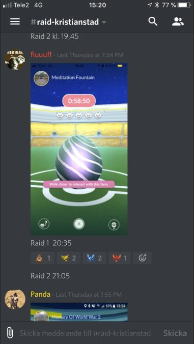
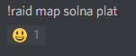
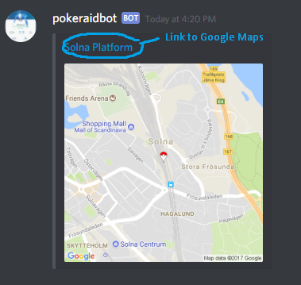
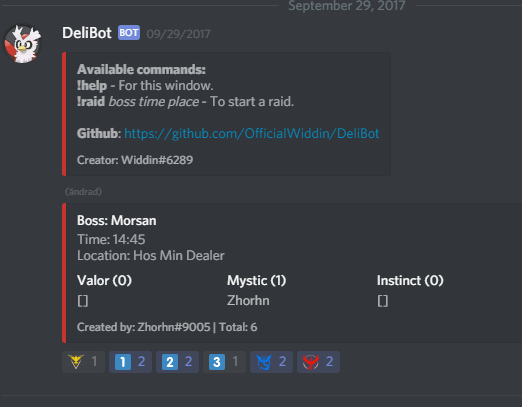
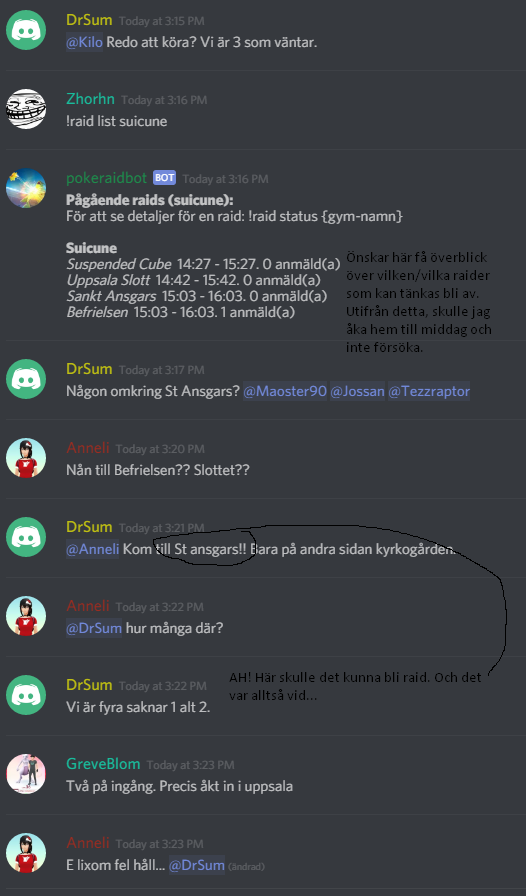
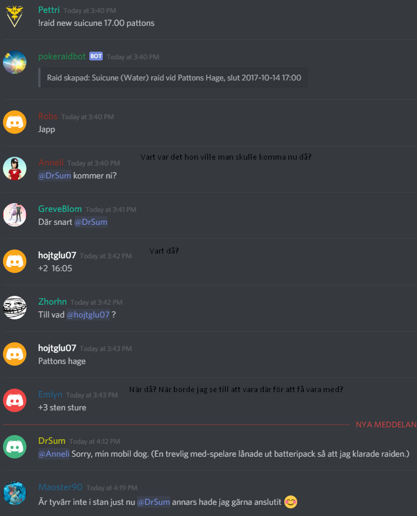

Ok, så man ska välja vägval för Pokemon Go Uppsalas discord raidhantering.

Följande huvudalternativ finns (som jag uppfattat det):

* "Skånemodellen"
    * !raid map och !raid vs är botkommandon. Inga övriga botkommandon för raids.
    * Raid anmäls via screenshots
    * Anmälan görs manuellt via en syntax användarna förhoppningsvis följer (t.ex. +1 10:00 Hästen).
    Syntax definieras via fäst meddelande.
    * Överblick fås via att scrolla i en viss raidkanal för den boss man är intresserad av
    * Pros:
        * Enkelt för användare, de är vana vid detta
        * Lätt för de som är en grupp med raiders som åker från raid till raid och bara behöver någon 
        enstaka till för att kunna köra
        * Tryggt att hålla kvar vid det gamla
    * Cons:
        * Att få en överblick är kaos, åtminstone om fler raider är aktuella samtidigt och folk inte har disciplin att berätta
        vilken raid de refererar till
        * Inte bra för "casuals" som vill få till en raid på lunchrast eller vägen hem och vill veta att en viss raid blir av i förväg
        * Dubbelförvaltning av mapbot och pokeraidbot
    * Förbättringspotential för pokeraidbot:
        * Pokeraidbot är inte aktuell här. Den kommer användas för andra servers och utvecklas utifrån deras behov.
        
Model 1, antingen som det varit i Uppsala med screenshot och +1-statements, eller som i Skåne:

        
        
* Mapbot och delibot
    * !raid map och !raid vs är mapbot från Uppsala. Raidhantering via delibot.
    * Raid anmäls via skapad grupp mha delibot, anmälan via emotes, liknande pokeraidbot
    * Överblick för en raidgrupp via meddelande som självuppdateras, givet bra kanalhantering kan det funka bra.
    Ingen överblick över flera raidgrupper i en vy.
    * Pros:
        * Mindre impact, färre kommandon för bottar, kanske mindre oro för osäkra? Färre saker att lära sig.
        * 2 bottar - fördela ansvar, lättare att byta ut en enskild bot
        * Delibot är testad och använd i Skellefteå så torde vara rätt stabil
    * Cons:
        * Hantering av grupper i isolering innebär ingen överblick
        * Lagknappar för delibot, vilket admins redan tyckt skulle bort från pokeraidbot pga komplext/förvirrande
        * Man sparar ett kommando för raidskapande, men tappar en hel del funktioner (t.ex. tracking av pokemons, raid status, raid list, 
        få hjälp med när en raid slutar)
    * Förbättringspotential för mapbot
        * Fuzzy search för gymnamn (kanske även pokemonnamn?)

* Full pokeraidbot
    * Botkommandon för allt. Se till att kanalhantering ses över och att folk faktiskt använder funktioner
    för att registrera raids och sig själva via aktiv moderering.
    * Raid anmäls via !raid new {pokemon} {tid (start eller slut)} {gym} eller screenshot, om vi får till automatisk
    igenkänning av information från ett screenshot via OCR
    * Anmälan kan göras via +1-kommando, !raid add (ev tas bort) samt !raid group?
    * Överblick fås via adminmeddelande i "read-only"-kanal med en självuppdaterande lista av registrerade raider + status
    * Pros:
        * Lätt att få överblick, så länge folk använder botten
        * Större möjligheter för IT-kunniga
        * Bra för folk som vill planera i förväg och har lite tid att göra det på
    * Cons:
        * Kräver att folk lär sig att ställa kommandon och en tillhörande syntax. En övergångsperiod som kan vara 
        skakig och leda till att en del medlemmar drar
        * Förändring = läskigt för en del
        * Om dålig struktur och plan för kanalhantering och informationsflöde - spam av meddelanden och leta på 
        information och skriva kommandon på flera ställen
    * Förbättringspotential för pokeraidbot
        * Ja. En hel del. Dokumentation, användarvänlighet, kanalspamreducering t.ex.
        * Raidrapportering via screenshot från mobil
            
För screenshots se [Guiden för att komma igång](GETTING_STARTED_USER_sv.md)            
            
------            
            
Mina tankar:

Jag förstår om en del (hur många får en poll utreda) vill återgå till hur det var innan.
Främst tror jag för raiders som har en grupp halvt redo on demand och ibland bara behöver någon extra för att få ner en raid,
eller folk som inte gillar IT mer än nödvändligt och tycker det är lurigt eller läskigt att skriva kommandon, t.ex. 

Dock, för de som befinner sig i min situation, har åtminstone jag 
ett problem med följande typ av hantering, där vi t.ex. ska försöka hinna med en eller ett par raider på en 
timme på väg till, på lunchrast eller på väg hem från jobbet, och inte vill slösa tid i onödan.

Har lagt in lite kommentarer i screenshots nedan för att illustrera vad jag har issues med rörande modell 1.

.. och lite senare på kvällen:

Oavsett vilken modell vi väljer, tror jag vi behöver få mer struktur och ordning och "utbilda" användarna
att anpassa sig. 

I modell 1 tycker jag Skånes variant ser strukturerad och tydlig ut samt kortfattad.
Den kan jag absolut tänka mig funkar för mina behov att få överblick. 

Gamla Uppsala-modellen gillar jag inte alls,
för mycket scrollning och läsa fram och tillbaka för att jag ska få reda på vart jag behöver vara när,
och även då ofta snabba ryck som innebär att man riskerar att missa en raidgrupp.

Modell 2; Korsning mellan mapbot och delibot kan absolut funka. Men jag tror den kommer få samma problem
med samma människor som pokeraidbot har idag, fast vi får färre features och ingen överblick.

Modell 3 behöver förbättras, helt klart. Jag tror för att det ska bli enkelt och hållbart tror jag följande krävs:
* Vi fixar till "getting-started"-guiden så den blir enklare och mer logisk. Att sprida ut vissa saker i olika kanaler tror
jag bara förvirrar, vi får reducera meddelande-spam på annat sätt IMO
* Vi admins går in och guidar folk som undviker botten och förklarar att om vi nu ska köra modell 3 (om det blir vårt alternativ)
så får vi försöka hjälpas åt att gå dit.
* Vi behöver se över kanalhanteringen, t.ex. en automatiskt uppdaterad overview som admins lägger in i en låst kanal skulle 
vara något, tror jag (så slipper vi !raid list och !raid status i raidkanalerna)
* Samla in idéer från användarna och sålla och fundera hur saker kan förbättras kontinuerligt över tid

Phew, mycket att läsa igenom. :) Bra jobbat om du kom ända hit.